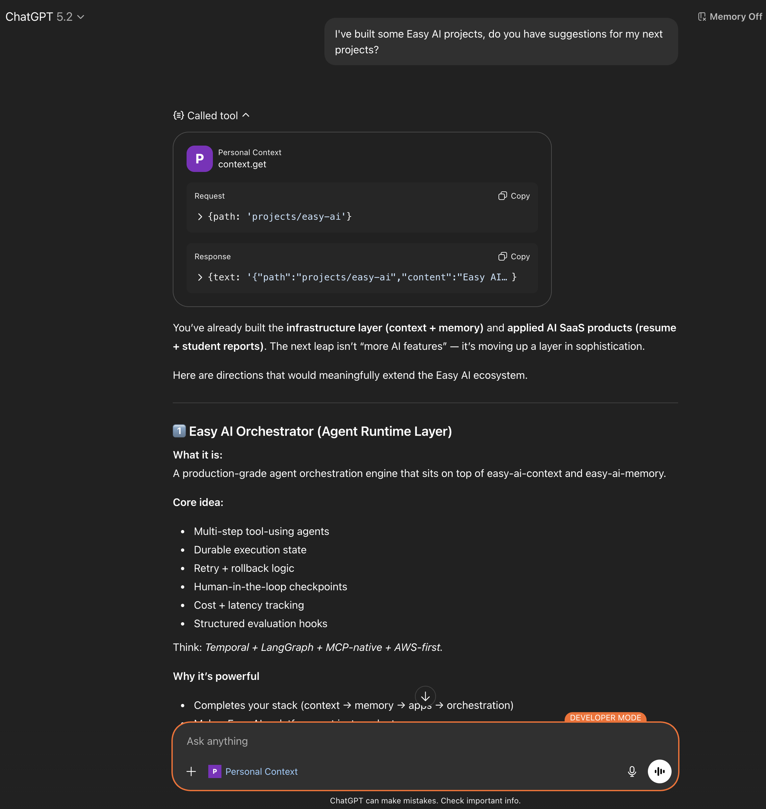
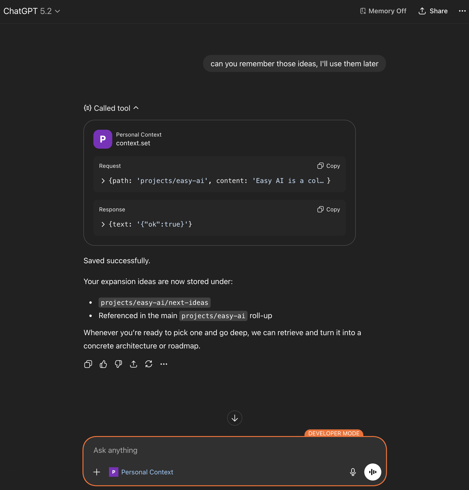
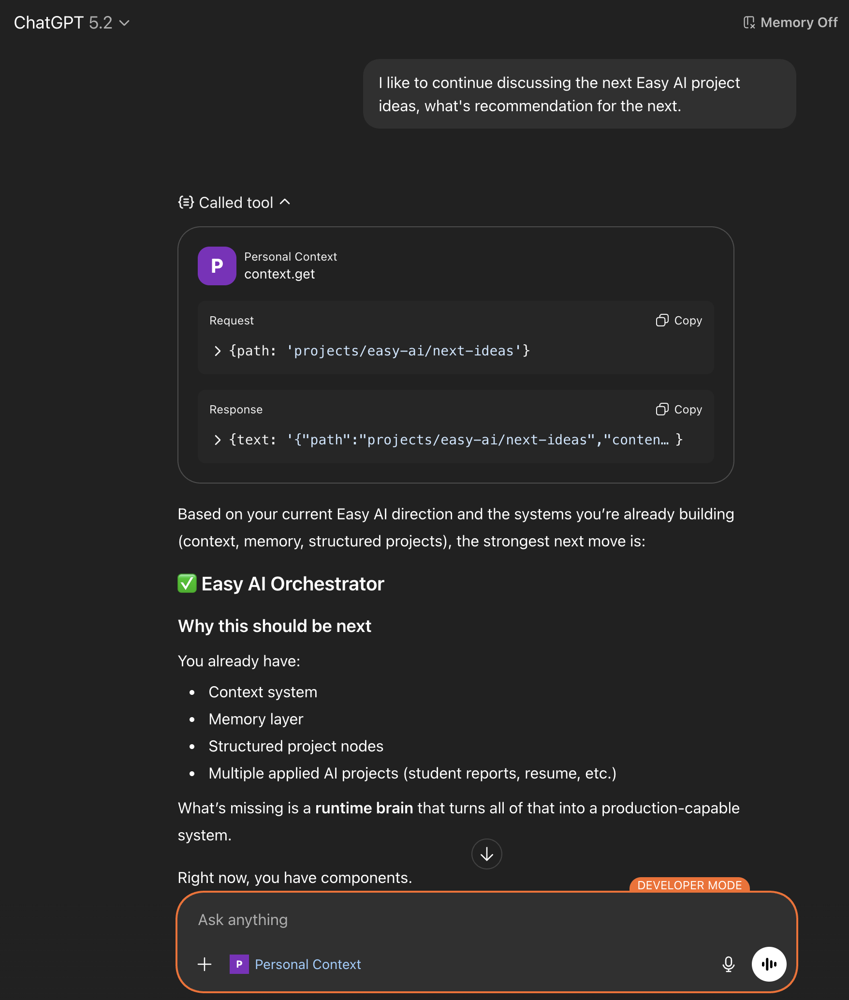

# Easy AI Context

Personal Context Service — an MCP server that lets AI assistants remember you (via a simple hierarchical “path → text” store).

## The pain this solves

Have you ever:

- Re-explained the same background to a new chat, a new model, or a new tool?
- Felt the “fresh start” penalty when an AI doesn’t know your projects, preferences, or current goals?
- Wanted a lightweight way to keep a curated, long‑term summary that you control?

Easy AI Context gives your assistant a **personal context tree** it can read/write using **four MCP tools**.

## Demo (ChatGPT)

Below is the typical flow: **get** context, **save** new context, then **continue** later by reloading it.

> Add the screenshots to `docs/assets/` using the filenames below so the images render on GitHub.

| Read context | Save context | Continue later |
|---|---|---|
| [](docs/assets/Gpt-read-context.png) | [](docs/assets/Gpt-save-context.png) | [](docs/assets/Gpt-continue-context.png) |

## Example context structure

Think of your context as a tree of paths (lowercase, `/` separated). For example:

```
projects
├── ai-home
├── easy-ai
│   ├── easy-ai-context
│   ├── easy-ai-memory
│   ├── easy-ai-resume
│   ├── easy-ai-report 
│   └── next-ideas
└── raspberry-pi-devbox
```

## What it is

This repo ships a **Model Context Protocol (MCP)** server with exactly these tools:

- `context.list_paths` → discover what context exists (paths only)
- `context.get` → read one node (path → content)
- `context.set` → upsert one node
- `context.delete` → delete one node (idempotent)

Under the hood, each node is a single DynamoDB item keyed by user + path (see `MIGRATION.md` for the table/GSI shape).

## Self-hosted + low cost

**Why this setup works well:**

- **Your data, your account.** You deploy into **your own AWS account**. All context lives in **your** DynamoDB table and stays under your control — nothing is sent to third‑party storage or other services. You own and govern your personal context.
- **Designed to be low cost (suitable for personal use).** The stack (API Gateway, Lambda, DynamoDB on-demand, Cognito) is pay‑per‑use; monthly bills stay small for typical personal use.

**Rough monthly cost** (assuming one user, on-demand DynamoDB, no Global Tables or PITR, US East–style pricing; Cognito’s first 10,000 MAUs/month are free):

| Tool calls / day | Tool calls / month | Typical cost range |
|---:|---:|---:|
| 100 | ~3,000 | ~$0.05–$0.30 |
| 1,000 | ~30,000 | ~$0.50–$2 |
| 10,000 | ~300,000 | ~$2–$10 |

Cost drivers: **API Gateway** ~$1/1M requests, **Lambda** ~$0.20/1M requests + compute, **DynamoDB** on-demand reads/writes + storage, **Cognito** free up to 10k MAUs then ~$0.015/MAU. See [API Gateway](https://aws.amazon.com/api-gateway/pricing/), [Lambda](https://aws.amazon.com/lambda/pricing/), [DynamoDB](https://aws.amazon.com/dynamodb/pricing/on-demand/), [Cognito](https://aws.amazon.com/cognito/pricing/) for current pricing. Actual cost depends on region, backup/log options, and usage.

## How an AI uses it (interaction pattern)

The intended interaction is **index-first, then targeted reads**:

1) **Fetch the index**: call `context.list_paths({})` to get the list of available paths (treat this as the tree index).
2) **Pick the smallest relevant prefix** for the current conversation (e.g. `projects/easy-ai`).
3) **Read parent first**: call `context.get({ path })` for that parent node.
4) **Drill down only if needed**: if you need details, fetch child nodes with additional `context.get` calls (don’t fetch the whole tree by default).
5) **Write only on user intent**: if the user asks to save/update context, call `context.set({ path, content })` and update parent roll-ups so summaries stay accurate.

This keeps tool usage fast and cheap: `list_paths` is the index, and `get` is the selective fetch.

## Policy & model guidance

- The full server description + context organization policy lives in `docs/SERVER_DESCRIPTION.md`.
- The model-facing operating rules live in `docs/PERSONAL_CONTEXT_MCP.md`.

## Docs

- `QUICKSTART.md` — run locally with Docker
- `docs/DEPLOY.md` — deploy to AWS (OAuth via Cognito)
- `docs/mcp-chatgpt-config.md` — ChatGPT connector setup
- `docs/mcp-cursor-config.md` — Cursor MCP config (not tested yet)
- `MIGRATION.md` — DynamoDB schema / GSI notes
- `docs/E2E-TEST-PLAN.md` — end-to-end test plan
- `docs/PRE-PUBLISH.md` — checklist before making the repo public

## Quickstart (local dev)

```bash
npm install
docker-compose up
```

- API: `http://localhost:3010`
- DynamoDB Local: `http://localhost:8010`

Local dev bypasses auth and uses a fake user identity (see `.env.dev`).

## Repo layout

```
easy-ai-context/
├── services/
│   └── api/              # Lambda handlers and business logic
├── packages/
│   └── shared/           # Shared TypeScript types and utilities
├── infra/                # AWS CDK infrastructure
├── docker-compose.yml    # Local development setup
└── README.md
```

## Tests

```bash
cd services/api
API_BASE_URL=http://localhost:3010 npm run test:integration
```

## License

MIT
